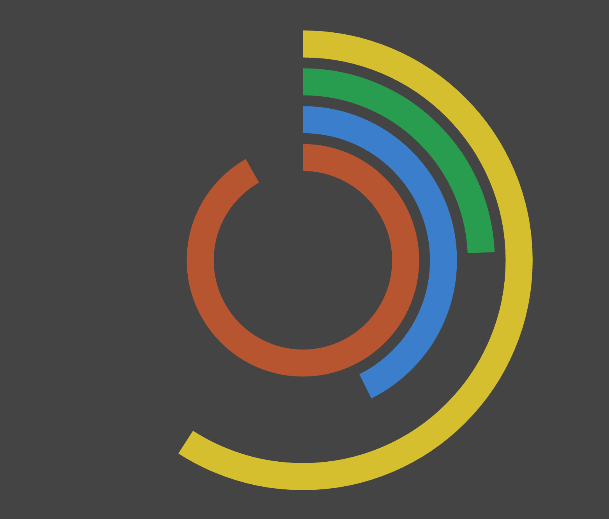

# yoyo-svg-clock

**An example of how to use [yo-yo](https://github.com/maxogden/yo-yo) to render SVG.**

## Contributing

If you **have a question**, **found a bug** or want to **propose a feature**, have a look at [the issues page](https://github.com/derhuerst/yoyo-svg-clock/issues).
